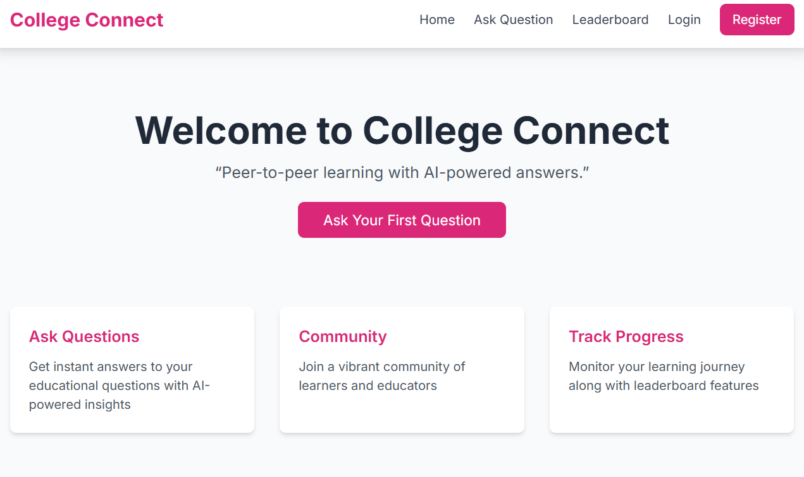
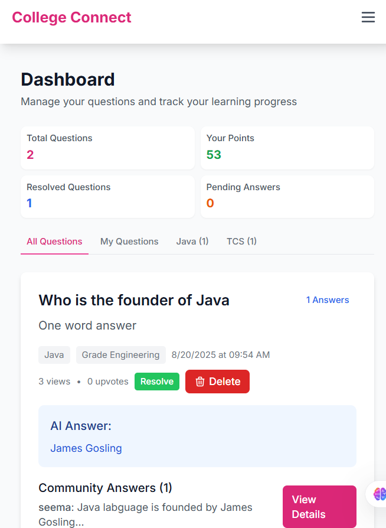
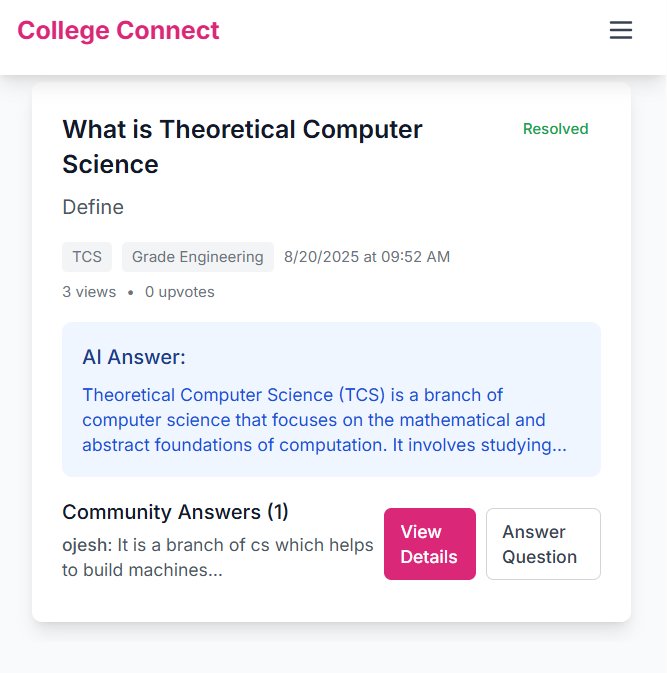
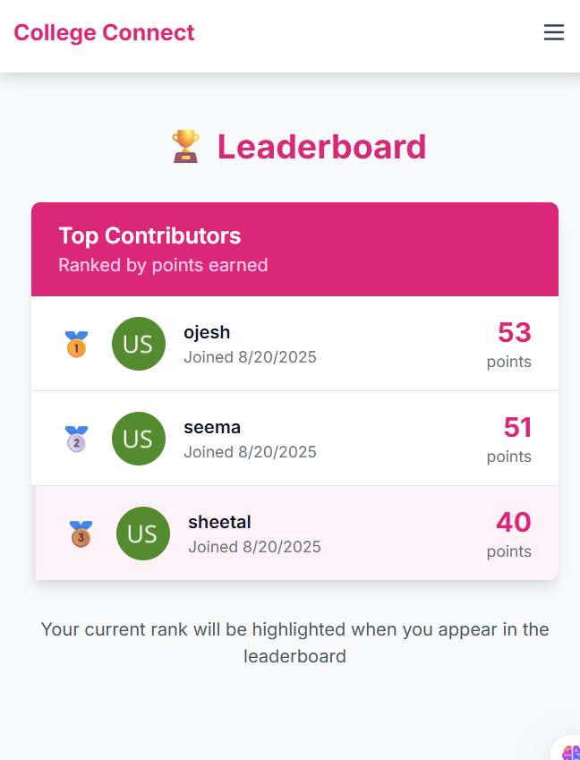

# College Connect AI – AI-Powered Peer-to-Peer Doubt Solving Platform

## 🎯 Problem Statement
Many students in India, especially in Tier 2/3 cities, face challenges in getting timely and accurate answers to their academic doubts. Traditional tutoring is expensive, and online communities are often slow or unreliable. Existing platforms are cluttered with content from 1st to 12th grade, making it difficult for engineering students to find relevant solutions.

## 🚀 Our Solution
College Connect AI is a **college-specific** web-based platform that allows students to:
- Ask academic questions tailored to their engineering curriculum
- Receive instant AI-generated answers using GPT-4o or OPENAI or (Gemini added for backup)
- Get help from senior students who've faced similar challenges
- Build a collaborative learning community within their college

## ✨ Unique Features
- **College-Specific Platform**: Designed exclusively for engineering colleges
- **Senior-Junior Connection**: Seniors can help juniors with proven solutions
- **AI + Peer Collaboration**: Combines AI assistance with peer expertise
- **Customizable Software**: Colleges can modify features as per their needs
- **Interactive, animated, and mobile-friendly UI**
- **Answer others questions and earn points**
- **20-word AI answer limit for quick consumption**
- **Shine on the leaderboard with highest points among peers**
- **User Profiles**: Track reputation, badges, and contribution history

## 🛠️ Tech Stack
- **Frontend:** React (Vite), Tailwind CSS, Framer Motion
- **Backend:** Node.js, Express.js, JWT authentication
- **Database:** MongoDB (Atlas or local)
- **AI:** OpenAI GPT-4o / Google Gemini

 ## 🖼️ Screenshots

  
*Homepage with AI-powered doubt solving*
<br>

  
*Student dashboard showing questions and answers*
  

  
*Student dashboard showing questions and answers*

## 🚀 Quick Start

### Prerequisites
- Node.js (v16+)
- MongoDB (local or Atlas)
- OpenAI API key or Gemini API key


## 🔧 Environment Variables
Create `.env` in backend folder:
```
MONGO_URI=mongodb://localhost:27017/collegeconnect
OPENAI_API_KEY=your-openai-key
JWT_SECRET=your-jwt-secret
PORT=5000
```

## 🎨 Features
- **College-Specific Authentication**: Use student ID instead of email
- **Responsive Design:** Works on all devices
- **Animations:** Smooth transitions with Framer Motion
- **Theme:** Pink + Light Blue color scheme
- **Real-time:** Instant AI responses
- **Collaborative:** Senior-junior peer learning network

## 🔮 Future Enhancements
- **Educator Integration**: Add professors and teaching assistants to the platform
- **Academic Integration**: Use leaderboard scores for additional academic marking
- **Department-Specific Channels**: Separate spaces for CSE, ECE, ME, CE, etc.
- **Year-Based Filtering**: Content organized by 1st, 2nd, 3rd, and 4th year
- **College Customization**: Each college can brand and modify the platform
- **Student ID Authentication**: Replace email login with college student ID system
- **Alumni Network**: Connect graduates to help current students
- **Placement Preparation**: Dedicated sections for interview prep and placement guidance


## Created by 

- **Ojesh Mundale** - Third year CSE student

